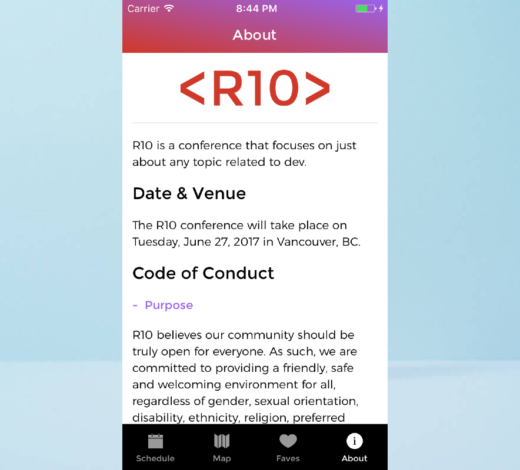

# R10

R10 is an IOS Mobile App developed using React Native. This App fetches the data from a public API and diplays in a beautifully designed pages in the App.
This project is fully functional App that has all functionalities of an IOS App with a very complex navigations into pages. It was part of App Dev Course in RED Academy that each student was supposed to code it in limitted period of times so that achieve the success score in React Native.

## Technoloogies used: 

* React Native
* Redux
* Apollo
* GraphQL
* Express
* PostGreSQL
* Git

## Software used in this Project:

* Visual Studio Code
* GitHub
* Google Chrome Developer Tools

## Developed by:
Alam Talash 

@: RED Academy Toronto

#### Date: April 2019
